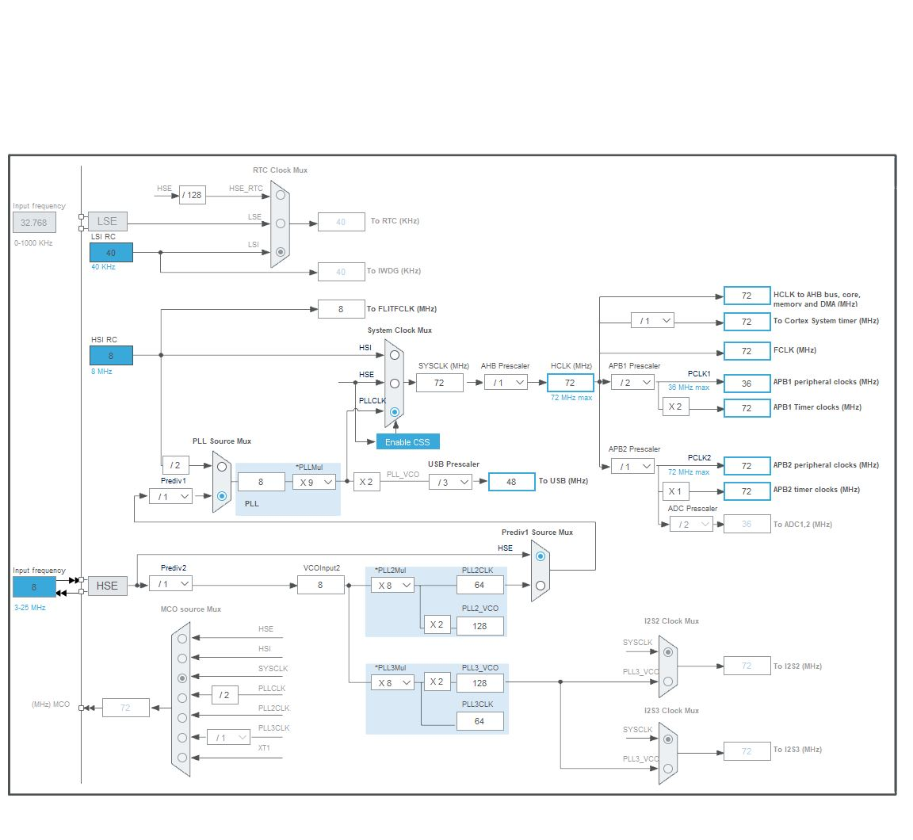

# Programação
O programa atualmente está configurado para que um botão SW no PC15 ative o interrupt que vai se comunicar por SPI com o controlador de LED para acender outro LED.
## Pinagem:

- SW (PC15): recebe o sinal para ativar o interrupt
- LED_RED (PB5):
- LED_YELLOW (PB6):
- 

## Configuração do CLK

## Periféricos:

- O TLC5922DAP, responsavel por acender os LEDs, é controlado por SPI, desta forma, o uC envia um comando de 16 bits que corresponde a quais LEDs serão acesos. Nele, será conectado um LED em seu Output 6 para verificar se a comunicação teve sucesso.

- O DS2413P+ é o circuito que faz a detecção da armadilha, ele se comunicará por 1wire, mas inicialmente está sendo utilizado um botão SW