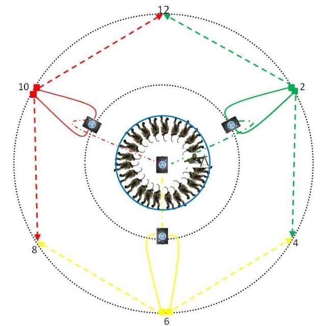
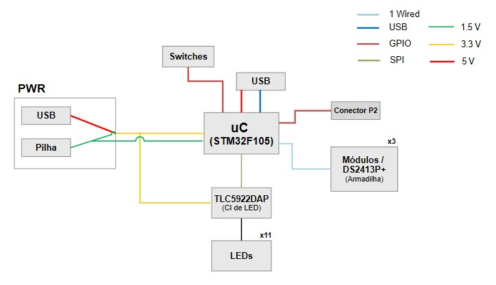
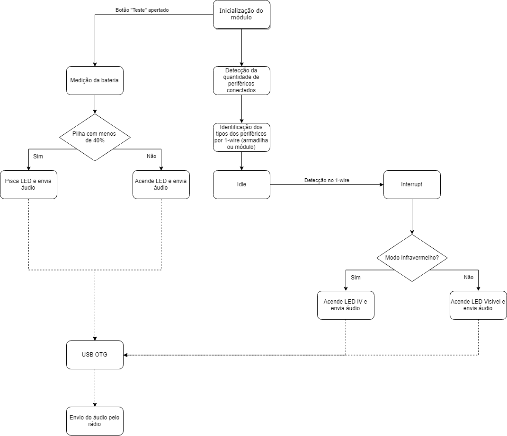

# Escopo do projeto
O projeto tem como objetivo criar um módulo que detecta quando uma armadilha for ativada, permitindo vigilância de uma determinada área de forma que a intrusão seja detectada de modo silencioso.
Esse módulo podera funcionar com até 3 setores (12h as 4h, 4h as 8h e 8h as 12h), acendendo LEDs de acordo com qual intrusão foi detectada.
Caso queira, será possível conectar até 3 módulos em um módulo central, aumentando a precisão da detecção para 6 setores (12h as 2h, 2h as 4h, 4h as 6h, 6h as 8h, 8h as 10h e 10h as 12h).

Ao ser detectada uma intrusão, além de acender o LED correspondente à área, o responsável pela vigia do módulo escutará uma mensagem de áudio por um fone de ouvido, que poderá ser retransmitida por rádio através de conexão com o rádio da IMBEL.
A fim de garantir furtividade durante a noite, o módulo possuirá um botão de acionamento seguro que muda os LEDs para o modo infravermelho.
O módulo funcionará por pilha (tipo AA), que contará com um detector de nivel de energia disponível, mas também poderá ser alimentado por USB.

## Diagrama de Blocos
A eletrônica seguirá o seguinte diagrama:

A alimentação passará por um step up (pilha) ou step down (USB) para 3,3V que servirá para todo o circuito.
Para controlar os LEDs sem ocupar muitas portas GPIO, será utilizado um CI controlado por SPI.
Por fim, a comunicação entre os módulos e armadilhas (CI de detecção DS2413P+) será feira por 1-Wire.

## Fluxograma

OBS: Demais detalhes da programação se encontram no Readme.md na pasta "Programacao"
## Componentes para teste
Para realizar um teste básico será necessário:
#### - Um uC STM32F105;
#### - Um módulo DS2413P+;
#### - Um CI TLC5922DAP;
#### - LEDs.
